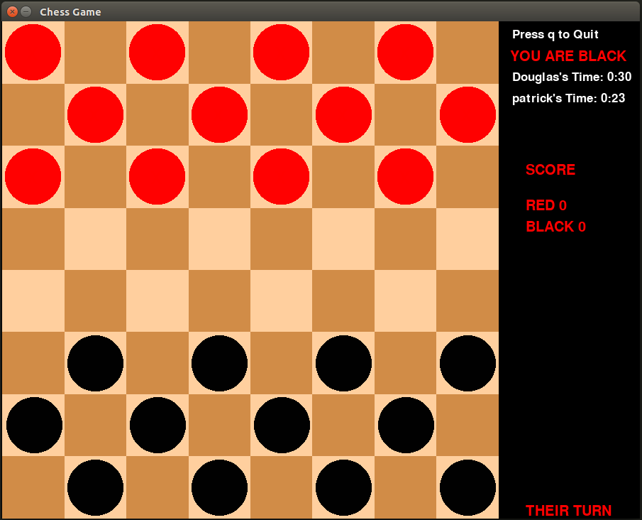

# Redes
Repositório destinado a disciplina de REDES

## Damas Multiplayer usando TCP  
O jogo de Damas tem dois  participantes, que usam um tabuleiro para jogar. O tabuleiro é composto de 24 peças, 12 vermelhas e 12 pretas. Tabuleiro possui 64 casas, claras e escuras.
São distribuídas 12 peças da mesma cor para cada jogador, posicionadas nas casas claras, ocupando as três linhas mais próximas de cada jogador. O objetivo de cada jogador é capturar todas as peças do oponente ou deixá-lo impossibilitado de mover.  

